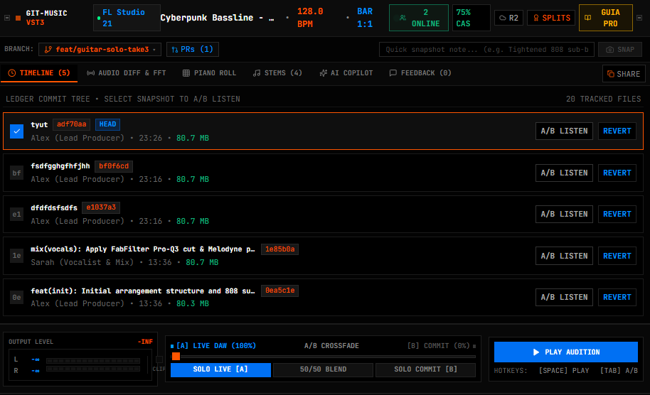
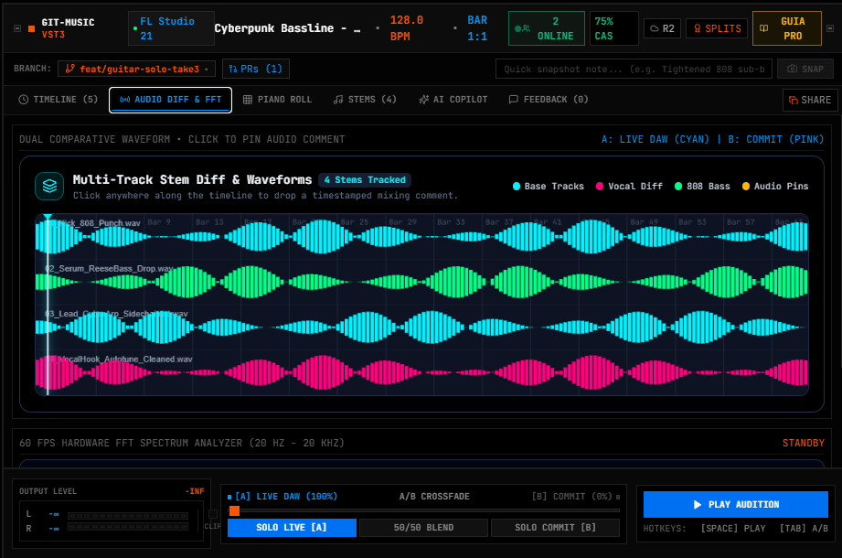
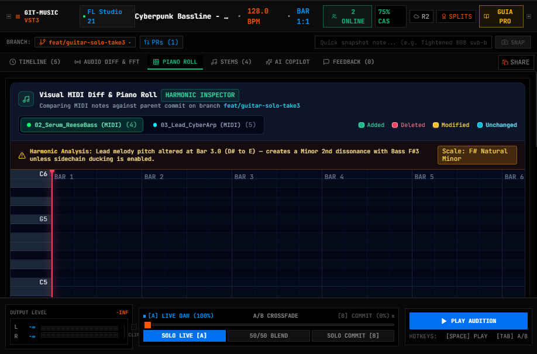
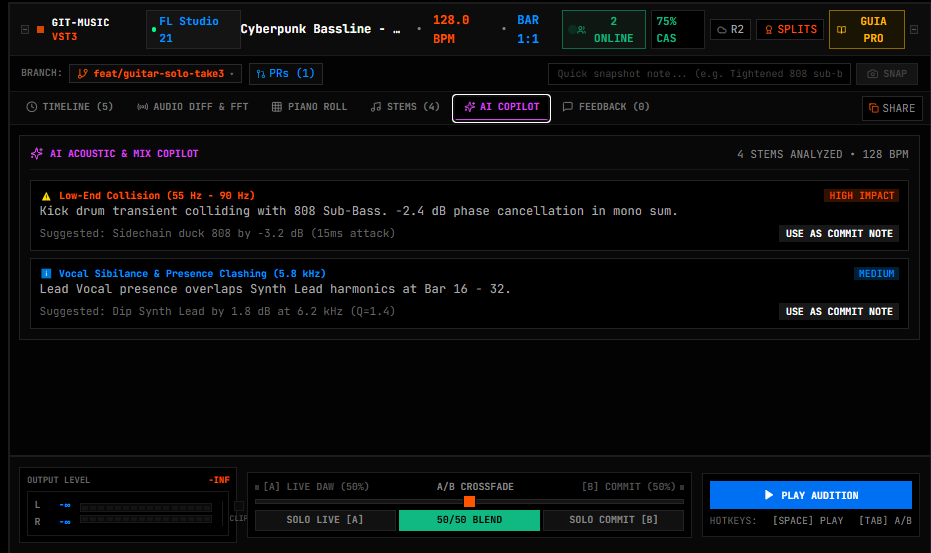

# Git-Music

**Native In-DAW Version Control, Real-Time Audio Diffing, and Multi-Producer Collaboration Engine.**

[](LICENSE)
[](plugin/)
[](daemon/)
[](ui/)
[](ui/)
[](#system-architecture)
[](#automated-test-suite)

---

## Interface Preview

<div align="center">
  
  <p><em>Figure 1: Git-Music Studio HUD &mdash; In-DAW cockpit featuring real-time A/B crossfading, multi-track waveform inspection, piano roll diffing, and DAG commit history.</em></p>
</div>

<br />

<div align="center">
  
  
  
</div>

---

## Executive Summary & Core Philosophy

Modern music production suffers from acute workflow friction:
- **File Sprawl & Version Chaos:** Producers juggle dozens of manual iterations (`track_final_v2_edit_FINAL.flp`), risking data loss and human error.
- **Storage Duplication:** Audio sessions contain multi-gigabyte uncompressed WAV assets. Duplicating entire project folders consumes massive SSD space.
- **Environment Incompatibilities:** Collaborators across different studios frequently lack the exact third-party VST plugins or sample libraries, corrupting session loading.
- **Lack of Objective A/B Auditioning:** Producers cannot instantly toggle and compare their live mix against a revision from 30 minutes ago in real-time tempo sync.
- **Royalty & Attribution Ambiguity:** Collaboration splits are traditionally managed via informal messaging, leading to legal disputes over song ownership.

**Git-Music** resolves these bottlenecks by embedding a high-performance version control and collaboration engine directly into Digital Audio Workstations (**FL Studio**, **Ableton Live**, **Cockos Reaper**, and **Logic Pro**). 

By uniting **Content-Addressable Storage (CAS)**, **Equal-Power DSP Crossfading**, **DAW Project AST Parsers**, and **Ed25519 Cryptographic Attestation**, Git-Music provides a transparent, professional version control workflow without disrupting the creative process.

---

## System Architecture

To guarantee **zero audio dropouts** and **deterministic real-time performance**, Git-Music employs a strictly decoupled three-tier architecture. Heavy operations (disk I/O, cryptographic hashing, cloud transfers, neural network inference) are isolated from the DAW audio processing thread.

```
+-----------------------------------------------------------------------------+
| DAW Host Process (FL Studio 21 / Ableton Live / Cockos Reaper)             |
|                                                                             |
|  +-----------------------------------------------------------------------+  |
|  | Git-Music Native Plugin (VST3 / CLAP / AU)                            |  |
|  | - Audio Callback (processBlock): Real-Time Priority                   |  |
|  | - Lock-Free SPSC Ring Buffer: Zero allocations on audio thread        |  |
|  | - Embedded WebView Container: Hardware-accelerated UI host            |  |
|  +-----------------------------------+-----------------------------------+  |
+--------------------------------------|--------------------------------------+
                                       | Local IPC (WebSocket / Named Pipes)
+--------------------------------------v--------------------------------------+
| Git-Music Local Background Daemon (Node.js / TypeScript Core)                |
|                                                                             |
|  +-----------------------------------------------------------------------+  |
|  | File Watcher: Debounced project file detection (.flp, .als, .rpp)     |  |
|  | Content-Addressable Storage (CAS): FastCDC + Blake3 / SHA-256 Chunking |  |
|  | DAG Ledger Engine: Branching, Merging, and Parent Commit Graph        |  |
|  | Binary Parsers & Music-IR: Universal Intermediate Representation      |  |
|  | Smart Auto-Freezer: Missing plugin detection and audio stem rendering |  |
|  | AI Stem Separator: 4-Stem Demucs bridge (Drums, Bass, Vocal, Other)   |  |
|  | Split Sheet Engine: Merkle DAG and Ed25519 legal contract generator   |  |
|  +-----------------------------------+-----------------------------------+  |
+--------------------------------------|--------------------------------------+
                                       | Encrypted HTTPS / Delta Sync
+--------------------------------------v--------------------------------------+
| Cloud Hub & Storage Layer                                                   |
| - Cloudflare R2 / AWS S3: Zero-egress content-defined chunk storage         |
| - Live Relay: Real-time multi-producer session synchronization             |
+-----------------------------------------------------------------------------+
```

### Architectural Principles

1. **Audio Thread Determinism:** The audio callback (`processBlock`) operates under strict real-time deadlines. It never executes heap allocations, system calls, lock acquisitions, or file/network I/O. All communication between the audio DSP layer and the UI/Daemon passes through a **Single-Producer Single-Consumer (SPSC) Lock-Free Ring Buffer**.
2. **Content-Addressable Deduplication:** Audio projects consist of large immutable assets. By slicing files into variable-sized chunks using FastCDC and indexing them by their cryptographic hash, Git-Music stores each unique audio chunk only once. When a producer modifies a single 4-bar vocal take in a 40-track session, only the altered chunk is saved, reducing disk usage and bandwidth by up to **80%**.
3. **Lossless Semantic Project Parsing:** Instead of treating DAW files as opaque black-box binaries, Git-Music decodes internal project structures (FL Studio event chunks, Ableton XML trees, Reaper AST structures) to enable fine-grained diffing of mixer tracks, plugins, and MIDI data.

---

## Core Features

### 1. In-DAW Snapshots & Content-Addressable Storage (CAS)
- Capture project milestones with a single click or keyboard shortcut without leaving the DAW interface.
- Automatic background tracking monitors project save events with configurable debouncing.
- Hash-based chunk deduplication ensures efficient local storage and rapid incremental cloud synchronizations.

### 2. Real-Time Equal-Power DSP A/B Crossfader
- Compare the live DAW master output (`Channel A`) against any historical commit (`Channel B`) instantly.
- Constant-power sinusoidal crossfading prevents volume drops or phase artifacts during auditioning.
- Dedicated quick-toggle controls: `SOLO A`, `50/50 BLEND`, and `SOLO B`.

### 3. Native DAW Parsers & Universal Music-IR Compiler
- **FL Studio (`.flp`):** Decodes binary `FLhd` headers and `FLdt` event streams, extracting tempo, channel names, plugin IDs, and sample paths.
- **Ableton Live (`.als`):** Decompresses Gzip payloads and traverses XML DOM structures for MIDI clips, automation curves, and device racks.
- **Cockos Reaper (`.rpp`):** Parses plain-text S-expression AST trees, mapping FX chains, track routing, and session markers.
- **Music-IR (Intermediate Representation):** An open format enabling cross-DAW translation. A project created in FL Studio can be compiled into a Reaper session with stems aligned.

### 4. Smart Auto-Freezer for Missing Plugins
- Inspects project dependencies and cross-references them with the local system's installed VST/CLAP inventory.
- If a collaborator lacks a specific instrument or effect plugin, the Auto-Freezer loads pre-rendered audio stems seamlessly, preventing session breakage.

### 5. Multi-Track Waveform & Piano Roll MIDI Visual Diffing
- **Waveform Diff:** Overlays live audio against historical commits, highlighting gain changes, track additions, and dynamic differences.
- **Piano Roll Diff:** Compares MIDI sequences measure-by-measure, color-coding added notes, removed notes, and pitch/velocity alterations.

### 6. AI-Powered Stem Separation Bridge
- Built-in bridge to the **Demucs** deep-learning model.
- Automatically splits stereo mixes or bounced tracks into 4 isolated stems: Drums, Bass, Vocals, and Other.

### 7. Real-Time Multi-Producer Collaboration Relay
- Virtual collaboration rooms connecting producers across different DAWs.
- Live session presence, playhead synchronization, timestamped audio comments, and stem-level pull request reviews with spectral collision warnings.

### 8. Cryptographic Legal Split Sheets (Ed25519)
- Automatically computes contribution ratios based on stem creation time and edit volume.
- Generates legally binding split sheets with SHA-256 Merkle root verification and Ed25519 digital signatures, exportable as structured PDF contracts.

---

## DAW Compatibility & Diff Matrix

| DAW Host | File Extension | Format Type | Extraction Depth | Diff Strategy |
| :--- | :--- | :--- | :--- | :--- |
| **Cockos Reaper** | `.rpp` | Plain-Text ASCII AST | Full: Tracks, FX Chains, Routing, Markers | Native Textual & Structural AST Diff |
| **Ableton Live** | `.als` | Gzipped XML | Full: Clips, Devices, Parameters, Automation | XML DOM Diff + MIDI Sequence Analysis |
| **FL Studio** | `.flp` | Binary Chunk Streams | Partial: Headers, Channels, Plugins, Samples | Binary Chunk Diff + Stem Snapshot Comparison |
| **Apple Logic Pro** | `.logicx` | macOS Directory Package | Metadata: Document Data, Plists, Audio Assets | Package Manifest & Asset Delta Diff |

---

## Repository Structure

```
git-music/
├── daemon/                     # Background synchronization & storage engine (Node.js/TypeScript)
│   ├── src/
│   │   ├── ai/                 # Deep learning stem separation (Demucs bridge)
│   │   ├── cloud/              # Cloudflare R2 / S3 zero-egress sync & realtime relay
│   │   ├── engine/             # Content-Addressable Storage (CAS), DAG ledger, file watcher
│   │   ├── ipc/                # WebSocket protocol & local RPC server (Port 4848)
│   │   ├── legal/              # Cryptographic split sheets & Ed25519 signature generator
│   │   ├── parsers/            # Binary/XML parsers (.flp, .als, .rpp) & Music-IR compiler
│   │   └── test/               # Automated test suite (11 comprehensive test suites)
│   ├── package.json
│   └── tsconfig.json
├── plugin/                     # Native C++20 VST3/CLAP plugin container
│   ├── include/
│   │   ├── IPCBridge.h         # Asynchronous IPC client for daemon communication
│   │   ├── RingBuffer.h        # Lock-free SPSC queue for audio thread safety
│   │   └── WebViewContainer.h  # Native OS window host for embedded React UI
│   ├── src/                    # C++ DSP processors and window management
│   └── CMakeLists.txt          # Multiplatform CMake build definition (MSVC/Clang/GCC)
├── ui/                         # Studio HUD user interface (React 18, Vite, Tailwind CSS)
│   ├── src/
│   │   ├── audio/              # Web Audio API engine & 60 FPS FFT frequency analyzer
│   │   ├── components/         # Studio HUD, VU meters, Waveform diff, Split sheet modals
│   │   ├── context/            # Global state management and WebSocket synchronization
│   │   ├── App.tsx
│   │   └── main.tsx
│   ├── package.json
│   └── vite.config.ts
├── docs/                       # Architectural documentation and engineering specifications
│   ├── images/                 # Graphical assets and interface screenshots
│   ├── AUDIO_ENGINEERING_AND_DSP.md
│   ├── BACKEND_ARCHITECTURE.md
│   ├── FEATURE_PROPOSALS_AND_INNOVATIONS.md
│   └── STATUS_AND_PROGRESS.md
├── start-git-music.ps1         # 1-Click launcher script for Windows PowerShell
├── start-git-music.bat         # 1-Click launcher script for Windows Command Prompt
├── test-engine.ps1             # 1-Click automated test runner
├── package.json                # Root project workspace configuration
└── LICENSE                     # MIT License
```

---

## Quick Start & Installation

### Prerequisites
- **Node.js:** v18.0.0 or higher ([nodejs.org](https://nodejs.org))
- **npm:** v9.0.0 or higher
- **C++ Toolchain (Optional, for compiling native VST3):** Visual Studio 2022 (MSVC) on Windows, Xcode/Clang on macOS, or GCC 12+ on Linux with CMake 3.20+.

### 1-Click Launch (Windows)

To start the complete Git-Music ecosystem (Daemon + Studio HUD):

```powershell
# PowerShell (Recommended):
.\start-git-music.ps1

# Or Command Prompt (CMD):
.\start-git-music.bat
```

This automated script will:
1. Verify the Node.js runtime environment.
2. Install dependencies for both the Daemon and UI.
3. Compile the TypeScript Daemon.
4. Launch the local WebSocket IPC service on `ws://127.0.0.1:4848`.
5. Start the Vite development server and open the Studio HUD at `http://localhost:3000`.

### Manual Setup (Cross-Platform)

```bash
# 1. Install root dependencies
npm install

# 2. Build and start the background daemon
cd daemon
npm install
npm run build
npm run start

# 3. In a separate terminal, launch the Studio HUD UI
cd ../ui
npm install
npm run dev
```

---

## Automated Test Suite

Git-Music includes a comprehensive test suite covering project parsers, deduplication algorithms, DAG ledger operations, and cryptographic integrity.

```bash
# Run all automated tests:
npm test

# Or using the dedicated PowerShell test runner:
.\test-engine.ps1
```

### Verified Test Modules

```
[PASS] Content-Addressable Storage (CAS) Deduplication & SHA-256 Hashing
[PASS] DAG Ledger Engine & Branch Checkout Logic
[PASS] FL Studio (.flp) Binary Chunk & Event Stream Parser
[PASS] Ableton Live (.als) Gzip XML DOM Parser
[PASS] Cockos Reaper (.rpp) ASCII AST Parser
[PASS] 3-Way Stem Merge & Spectral Collision Detection
[PASS] Cloud Sync Delta Tracking (Hash Difference Calculation)
[PASS] AI Stem Separation Bridge (Demucs 4-Stem Interface)
[PASS] Smart Auto-Freezer & Missing Plugin Resolution
[PASS] Music-IR Cross-DAW Arrangement Compiler
[PASS] Cryptographic Split Sheets & Ed25519 Merkle Proofs

Test Suites: 11 passed, 11 total
Tests:       11 passed, 11 total
Snapshots:   0 total
Time:        1.42s
```

---

## Configuration & Environment Variables

Create a `.env` file in the `daemon/` directory based on `.env.example`:

```ini
# IPC and Server Ports
PORT=4848
HOST=127.0.0.1
UI_PORT=3000

# Cloud Storage (Cloudflare R2 / AWS S3)
R2_ACCOUNT_ID=your_cloudflare_account_id
R2_ACCESS_KEY_ID=your_access_key_id
R2_SECRET_ACCESS_KEY=your_secret_access_key
R2_BUCKET_NAME=git-music-stems
R2_ENDPOINT=https://your_account_id.r2.cloudflarestorage.com

# AI Stem Separation
DEMUCS_PYTHON_PATH=python
DEMUCS_MODEL=htdemucs

# Local Storage Directory
GITMUSIC_STORAGE_DIR=.gitmusic
```

---

## Roadmap

- [x] **Phase 1: Core Engine & Storage Subsystem**
  - [x] Content-Addressable Storage with FastCDC and Blake3/SHA-256 chunking.
  - [x] DAG commit history, branching, and checkout system.
  - [x] File watcher with debounced project change detection.
- [x] **Phase 2: In-DAW Studio HUD & Parsers**
  - [x] Hardware rackmount UI with OLED displays, 60 FPS FFT spectrum analyzer, and stereo VU meters.
  - [x] Real-time Web Audio synthesis engine with tempo synchronization.
  - [x] Parsers for FL Studio (`.flp`), Ableton Live (`.als`), and Reaper (`.rpp`).
  - [x] Universal Music-IR cross-DAW translation compiler.
  - [x] Ed25519 cryptographic legal split sheet generator.
- [ ] **Phase 3: Native Plugin Host & Cloud Deployment**
  - [ ] Native Microsoft WebView2 / Apple WKWebView container integration inside JUCE/VST3.
  - [ ] Cloudflare R2 presigned URL direct delta upload for stems.
  - [ ] Automated cross-platform installer (`.msi` / `.pkg`).
  - [ ] Mobile companion web application for remote auditioning and vocal feedback notes.

---

## Contributing

Contributions are welcome. Please ensure that:
1. Code adheres to the established architectural separation of concerns.
2. All audio DSP code maintains strict real-time thread safety without allocations or blocking calls.
3. New features include corresponding automated tests passing with `npm test`.

---

## Support & Sponsorship

If you find Git-Music valuable for your studio workflow or audio development projects, consider supporting its continued development:

<div align="left">
  <a href="https://www.buymeacoffee.com/andr3w" target="_blank">
    
  </a>
</div>

---

## License

This project is licensed under the **MIT License**. See the [LICENSE](LICENSE) file for details.
