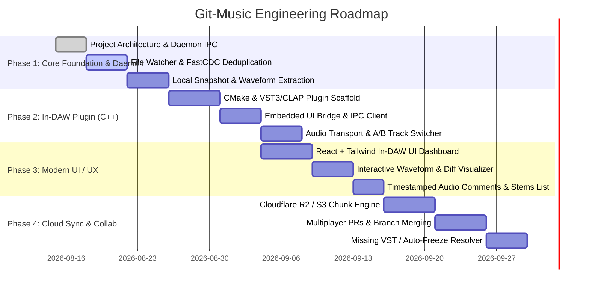

# 🗺️ Git-Music: Master Product & Engineering Roadmap

This document outlines the step-by-step master plan to build **Git-Music** from an architectural prototype into a production-grade in-DAW collaboration ecosystem for FL Studio, Ableton Live, Reaper, and Logic Pro.

---

## 🧭 High-Level Timeline & Phases

---

## 📍 Detailed Phase Breakdown

### 🎯 Phase 1: Core Daemon & Local Storage Engine (`/daemon`)
*The invisible background engine handling file tracking, hashing, snapshots, and IPC.*
* [x] **Monorepo setup & Toolchain configuration** (Node.js, C++ MSVC/CMake, React).
* [ ] **High-Performance File Watcher (`notify` / `chokidar`):**
  * Auto-detect when `.flp`, `.als`, `.rpp` or linked audio samples are saved in the project folder.
* [ ] **Content-Addressable Audio Storage (CAS):**
  * Fast Content-Defined Chunking (**FastCDC**) + **Blake3/SHA-256** hash indexing.
  * Deduplication engine: if 40 tracks remain untouched and only 1 stem is modified, only that stem is processed.
* [ ] **Local Snapshot & History Engine:**
  * Local Git-like commit ledger (stored in `.gitmusic/ledger.json` or SQLite).
  * Branch management (`main`, `feat/...`, `mix-v2`).
* [ ] **Local IPC Server (WebSocket / Named Pipe):**
  * Sub-millisecond communication with the C++ plugin and UI.

---

### 🎹 Phase 2: C++ In-DAW Plugin (`/plugin`)
*The native VST3 / CLAP plugin that lives inside FL Studio's mixer or master channel.*
* [ ] **Modern CMake & C++20 Project Structure:**
  * Support for VST3 and CLAP (CLever Audio Plugin) architectures.
* [ ] **Zero-Allocation Audio Thread Safety:**
  * `processBlock()` implementation with lock-free ring buffers (SPSC).
  * Audio thread never blocks on disk I/O, network, or UI rendering.
* [ ] **Host Transport Synchronization:**
  * Reads DAW tempo (BPM), playhead position (bars/beats), and time signature from the DAW host.
* [ ] **A/B Audio Comparison Engine:**
  * Smooth crossfade switch between the live DAW master and a cached stem snapshot from a previous commit or branch.
* [ ] **Embedded WebView Container:**
  * Renders the React UI seamlessly inside the plugin window.

---

### 🎨 Phase 3: In-DAW User Interface & Visual Diff (`/ui`)
*The visual cockpit where the music producer interacts with versions, waveforms, and collaborators.*
* [ ] **Modern Dark Glassmorphism Design System:**
  * Crafted specifically for music producers (high-contrast, neon accents, dark mode matching FL Studio/Ableton).
* [ ] **Interactive Waveform & Spectrogram Visualizer:**
  * Visual representation of audio tracks, showing additions, cuts, and volume shifts between commits.
* [ ] **Branch & Commit Graph:**
  * Visual Git tree with single-click branching, tagging, and switching.
* [ ] **Timestamped Audio Commenting:**
  * Click anywhere on the waveform timeline to drop a pin with feedback (e.g. `01:14` *"Reduce hi-hat volume"*).
* [ ] **Stem & VST Inventory Inspector:**
  * Lists all audio stems, sample files, and third-party plugins in the project.

---

### ☁️ Phase 4: Cloud Collaboration & Sync Gateway (`/cloud`)
*The decentralized sync network connecting remote producers in real-time.*
* [ ] **Zero-Egress Object Storage Sync:**
  * Upload and download deduplicated chunks to Cloudflare R2 / AWS S3.
* [ ] **Real-time Collaboration & Presence:**
  * Live status showing which collaborator is currently editing which branch.
* [ ] **Stem Pull Requests & Merges:**
  * Merge stems from another producer's branch into your master project with conflict resolution.
* [ ] **Smart Missing VST Freeze Resolver:**
  * If producer B doesn't have *Serum* or *Omnisphere*, download the auto-rendered audio stem seamlessly.

---

### 🚀 Phase 5: Distribution & Polishing
* [ ] Windows & macOS installers (`.vst3`, `.clap`, `.component`).
* [ ] FL Studio preset integration and DAW auto-detection.
* [ ] End-to-end integration tests with real `.flp` and `.als` project files.
